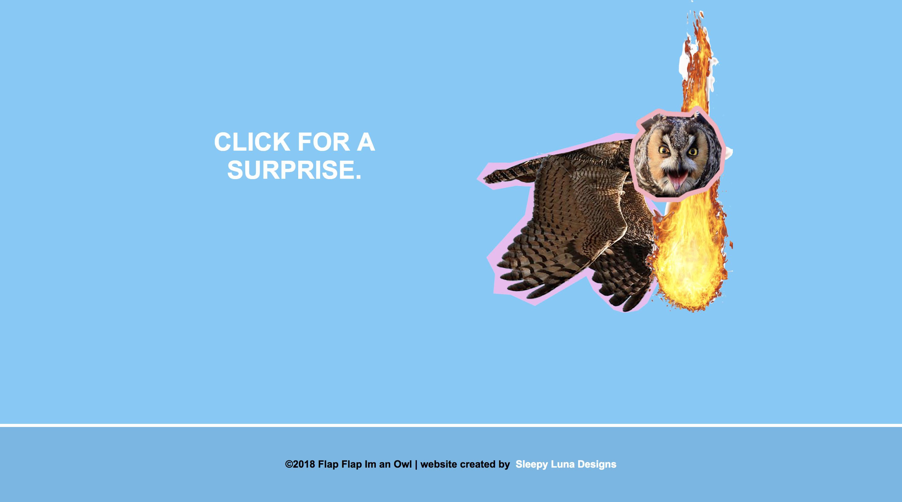

# Flap-Flap-Im-An-Owl
- Website created with standard HTML, CSS, and JAVASCRIPT used for testing purposes. Made with Dreamweaver and Photoshop. This site is just a dumb site that has a flapping owl you can click on to shoot fire. #SLD

# General
## Running/Viewing/Building
- For development this site was built with Dreamweaver, and so, should be able to run or be opened on any text editors.

## Publishing
- GitHub pages runs this particular site.

## Viewing Live
- https://smacknat.github.io/Flap-Flap-Im-An-Owl/

## Example Images (09/09/18)
| O.P | Panel | |
| --- | --- | --- |
| `PC/MAC` | Home |  |
| `Mobile` | Home |  |

### Updated: 09/09/18
