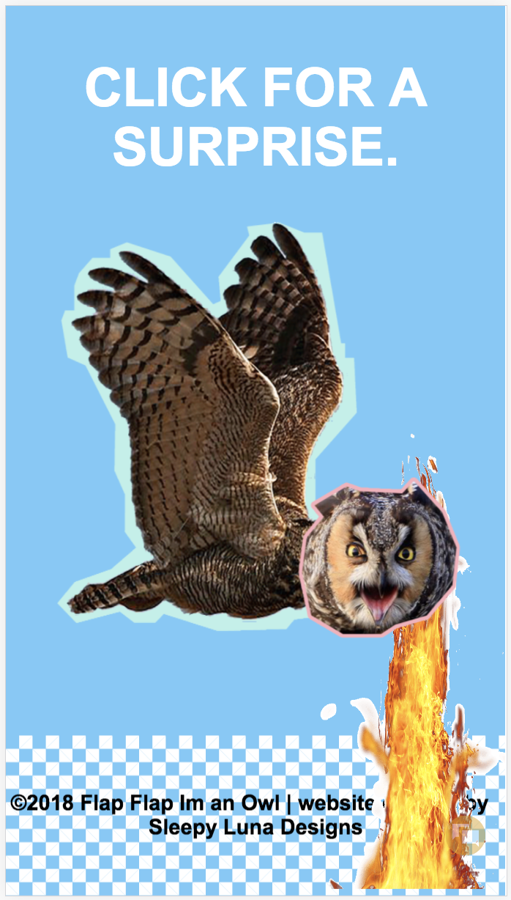

# Flap-Flap-Im-an-OWL
Website created with standard HTML, CSS, and JAVASCRIPT used for testing purposes. Made with Dreamweaver and Photoshop. This site is a fun site that sports a flapping owl you can click on to shoot fire. The site is finished, but will later be updated with better controls and content.

## Running/Viewing/Building
For development this site was built with Dreamweaver, and so, should be able to run or be opened on most any programs that can read .html and .css files.

for publishing
github pages runs this particular site.

for viewing live
https://smacknat.github.io/Flap-Flap-Im-an-OWL/

## Example Images (if GitHub pages is having trouble rendering .css)
**desktop view**
- 

**mobile view**
- 
